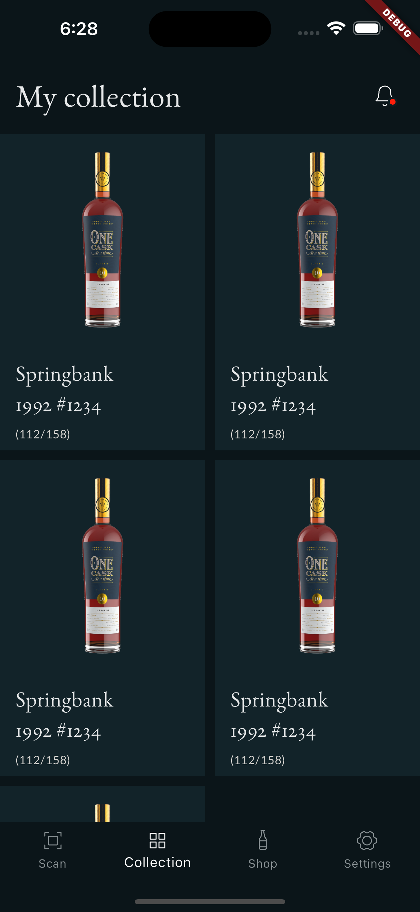
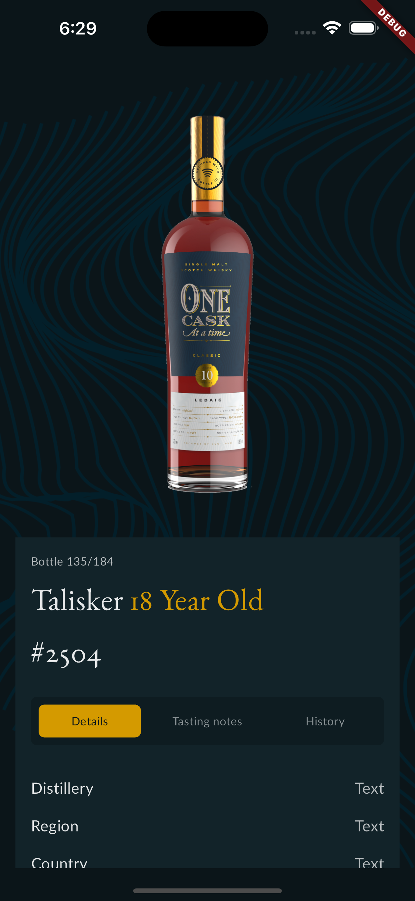
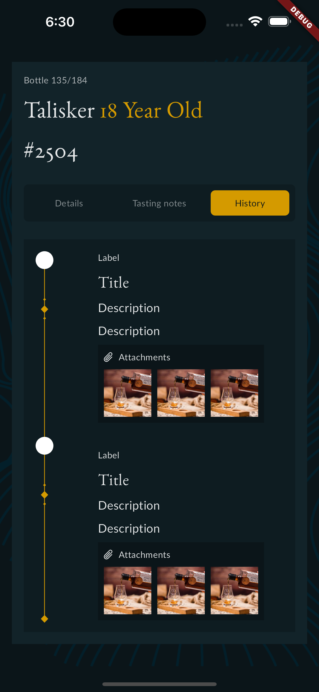

# Online Shop Demo

A Flutter Demo app for browsing and purchasing wines. It uses BLoC for state management and Hive for local data storage.
This app Uses mockup JSON files instead of REST API. This connection will be available only when internet connection is available.
When the app is not connected to internet it uses the stored data.
## Features

- Display a grid view of wines with images, names, descriptions and etc.
- BLoC for state management
- Persistent user login state using Hive.
- Bottom navigation with multiple screens (Scan, Collection, Shop, Setting).
- Fetch data from mock JSON files.

## Screenshots

Hope you enjoy it...

